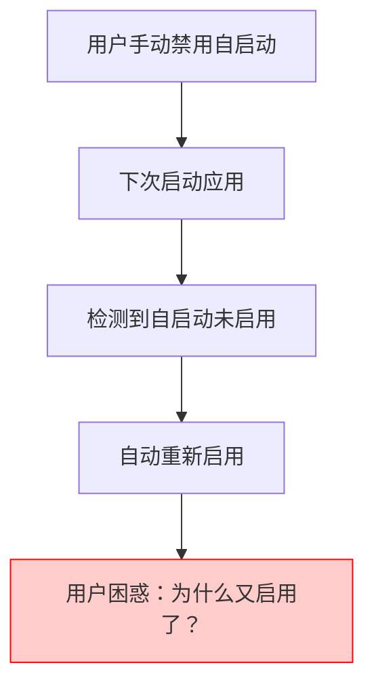

# 🔍 方案详细分析：启动时自动设置

## 📋 方案概述
**方案名称**: 启动时自动设置
**核心思路**: 在每次应用启动时检查并自动设置自启动功能
**实现位置**: `resolve_setup_async()` 函数中
**触发频率**: 每次应用启动

## 🏗️ 技术架构分析

### 当前启动流程分析
基于对 `resolve_setup_async()` 函数的分析，当前启动流程如下：

```rust
pub async fn resolve_setup_async(app_handle: &AppHandle) {
    // 1. 版本信息初始化
    VERSION.get_or_init(|| version.clone());
    
    // 2. 协议和启动脚本初始化
    init::init_scheme();
    init::startup_script().await;
    
    // 3. 配置系统初始化
    Config::init_config().await;
    
    // 4. Profile文件清理
    Config::profiles().latest_ref().auto_cleanup();
    
    // 5. 核心管理器启动
    CoreManager::global().init().await;
    
    // 6. 内嵌服务器启动
    server::embed_server();
    
    // 7. 系统托盘创建
    tray::Tray::global().create_tray_from_handle(&app_handle);
    
    // 8. 系统代理更新
    sysopt::Sysopt::global().update_sysproxy().await;
    
    // 9. 窗口创建
    create_window(!is_silent_start);
    
    // 10. 定时器初始化
    timer::Timer::global().init();
    
    // 11. 热键初始化
    hotkey::Hotkey::global().init();
    
    // 12. 自动导入订阅
    auto_import_startup_urls().await;
    
    // ✨ 插入点：这里可以添加自动启用自启动的逻辑
}
```

### 🎯 方案一实现方式

#### 1. 实现位置选择
**最佳插入点**: 在步骤8（系统代理更新）之后，步骤9（窗口创建）之前

**理由**:
- 此时配置系统已完全初始化
- 系统级操作（如系统代理）已处理完毕
- 窗口尚未创建，不会影响用户界面显示
- 如果出错，不会影响核心功能的启动

#### 2. 具体实现代码

```rust
// 在 resolve_setup_async 函数中添加
pub async fn resolve_setup_async(app_handle: &AppHandle) {
    // ... 现有初始化逻辑 ...
    
    // 系统代理更新
    logging_error!(
        Type::System,
        true,
        sysopt::Sysopt::global().update_sysproxy().await
    );
    
    // ✨ 新增：自动启用自启动功能
    if let Err(e) = auto_enable_autostart_on_startup().await {
        logging!(
            warn,
            Type::Setup,
            true,
            "自动启用自启动功能失败: {}",
            e
        );
    }
    
    // ... 继续现有逻辑 ...
}

// 新增函数：启动时自动启用自启动
async fn auto_enable_autostart_on_startup() -> Result<()> {
    logging!(info, Type::Setup, true, "检查并自动启用自启动功能...");
    
    // 获取当前自启动状态
    let current_state = {
        let verge = Config::verge().latest_ref();
        verge.enable_auto_launch.unwrap_or(false)
    };
    
    // 如果已经启用，跳过
    if current_state {
        logging!(info, Type::Setup, true, "自启动功能已启用，跳过自动设置");
        return Ok(());
    }
    
    // 检查平台支持
    #[cfg(target_os = "windows")]
    let platform_supported = true;
    #[cfg(target_os = "macos")]
    let platform_supported = true;
    #[cfg(target_os = "linux")]
    let platform_supported = true; // 根据实际情况调整
    
    if !platform_supported {
        logging!(
            warn,
            Type::Setup,
            true,
            "当前平台不支持自动启用自启动功能"
        );
        return Ok(());
    }
    
    // 自动启用自启动
    logging!(info, Type::Setup, true, "自动启用系统自启动功能...");
    
    let patch = crate::config::IVerge {
        enable_auto_launch: Some(true),
        ..Default::default()
    };
    
    crate::feat::patch_verge(patch, false).await?;
    
    logging!(info, Type::Setup, true, "系统自启动功能已自动启用");
    Ok(())
}
```

## 📊 优缺点深度分析

### ✅ 优点详解

#### 1. **实现简单直接**
- **代码量少**: 只需添加一个函数和一次调用
- **逻辑清晰**: 每次启动检查→未启用则启用
- **集成容易**: 直接插入现有启动流程
- **调试方便**: 问题容易定位和修复

#### 2. **自我修复能力**
- **状态恢复**: 如果自启动被意外禁用，下次启动会自动恢复
- **配置同步**: 确保实际系统设置与应用配置一致
- **错误恢复**: 如果之前设置失败，会在下次启动重试

#### 3. **用户透明**
- **无感知**: 用户不需要任何额外操作
- **即时生效**: 启动后立即检查和设置
- **日志记录**: 所有操作都有详细日志

### ❌ 缺点详解

#### 1. **性能影响分析**
```rust
// 每次启动都会执行的操作：
async fn auto_enable_autostart_on_startup() -> Result<()> {
    // 1. 读取配置文件 (~1-2ms)
    let current_state = Config::verge().latest_ref().enable_auto_launch;
    
    // 2. 如果未启用，执行设置操作
    if !current_state.unwrap_or(false) {
        // 3. 更新配置 (~5-10ms)
        patch_verge(patch, false).await?;
        
        // 4. 系统级设置 (~10-50ms，取决于平台)
        // - Windows: 创建快捷方式或注册表操作
        // - macOS: LaunchAgent 设置
        // - Linux: Desktop entry 创建
    }
    
    Ok(())
}
```

**性能开销**:
- **首次启动**: 15-60ms（需要实际设置）
- **后续启动**: 1-2ms（仅检查配置）
- **总体影响**: 在1-2秒的启动时间中，影响微乎其微

#### 2. **用户体验冲突**


**冲突场景**:
1. 用户出于某种原因手动禁用自启动
2. 下次启动时，系统自动重新启用
3. 用户可能感到困惑或不满

#### 3. **系统权限问题**
- **管理员模式**: 在管理员模式下可能无法正常设置
- **权限提升**: 某些平台可能需要额外权限
- **企业环境**: 企业策略可能禁止自启动设置

## 🔧 实现细节和注意事项

### 1. 错误处理策略
```rust
async fn auto_enable_autostart_on_startup() -> Result<()> {
    // 使用 scopeguard 确保错误不影响启动
    let _guard = scopeguard::guard((), |_| {
        logging!(info, Type::Setup, true, "自动启用自启动功能完成（含错误处理）");
    });
    
    match try_enable_autostart().await {
        Ok(_) => {
            logging!(info, Type::Setup, true, "自启动功能自动启用成功");
        }
        Err(e) => {
            // 记录错误但不中断启动流程
            logging!(
                warn,
                Type::Setup,
                true,
                "自动启用自启动功能失败，但不影响应用启动: {}",
                e
            );
        }
    }
    
    Ok(()) // 始终返回成功，不中断启动
}
```

### 2. 平台兼容性处理
```rust
async fn check_platform_autostart_support() -> bool {
    #[cfg(target_os = "windows")]
    {
        // Windows: 检查是否有写入启动文件夹的权限
        use crate::utils::autostart::get_startup_dir;
        get_startup_dir().is_ok()
    }
    
    #[cfg(target_os = "macos")]
    {
        // macOS: 检查 LaunchAgent 支持
        true // 通常都支持
    }
    
    #[cfg(target_os = "linux")]
    {
        // Linux: 检查桌面环境和 autostart 目录
        std::env::var("XDG_CONFIG_HOME").is_ok() || 
        std::env::var("HOME").is_ok()
    }
}
```

### 3. 配置状态检查优化
```rust
async fn should_auto_enable_autostart() -> bool {
    let verge = Config::verge().latest_ref();
    
    // 检查当前状态
    let current_enabled = verge.enable_auto_launch.unwrap_or(false);
    if current_enabled {
        return false; // 已启用，无需设置
    }
    
    // 检查是否是管理员模式（可能不支持）
    #[cfg(target_os = "windows")]
    {
        if crate::utils::help::is_admin() {
            logging!(
                info,
                Type::Setup,
                true,
                "检测到管理员模式，跳过自动启用自启动"
            );
            return false;
        }
    }
    
    // 检查平台支持
    check_platform_autostart_support().await
}
```

## 📈 性能基准测试建议

### 测试场景
1. **冷启动测试**: 首次安装后的启动时间
2. **热启动测试**: 已配置后的启动时间
3. **错误场景测试**: 权限不足时的处理时间
4. **并发测试**: 多实例启动时的行为

### 性能指标
- **启动时间增加**: < 50ms（首次）, < 5ms（后续）
- **内存使用**: 无明显增加
- **CPU使用**: 峰值 < 1%
- **磁盘IO**: 最小化文件操作

## 🎯 推荐的实现策略

### 阶段1: 基础实现
```rust
// 最简实现，先验证可行性
async fn auto_enable_autostart_simple() -> Result<()> {
    let verge = Config::verge().latest_ref();
    if !verge.enable_auto_launch.unwrap_or(false) {
        let patch = IVerge {
            enable_auto_launch: Some(true),
            ..Default::default()
        };
        crate::feat::patch_verge(patch, false).await?;
    }
    Ok(())
}
```

### 阶段2: 增强实现
```rust
// 添加错误处理和平台检查
async fn auto_enable_autostart_enhanced() -> Result<()> {
    // 平台支持检查
    if !check_platform_autostart_support().await {
        return Ok(());
    }
    
    // 权限检查
    if !check_autostart_permissions() {
        return Ok(());
    }
    
    // 状态检查和设置
    if should_auto_enable_autostart().await {
        enable_autostart_with_retry().await?;
    }
    
    Ok(())
}
```

## 📋 总结

**方案一的核心特点**:
- ✅ **实现简单**: 代码量少，逻辑直接
- ✅ **自我修复**: 能够恢复被意外禁用的设置
- ❌ **用户冲突**: 可能与用户意图冲突
- ❌ **性能开销**: 每次启动都执行检查

**适用场景**:
- 希望确保自启动功能始终启用
- 用户很少手动禁用自启动
- 对启动性能要求不是极致严格

**不适用场景**:
- 用户经常需要临时禁用自启动
- 对启动性能有极致要求
- 企业环境中需要严格的用户控制权
